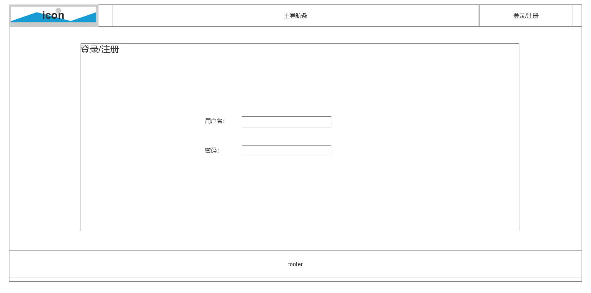

## Login

* Appearance



* Result Code
```
url: /login/

 0   登录成功
-100 表单错误
-200 用户名或密码错误
```

---

## Register

* Appearance


* Result Code
```
url: /register/

 0   注册成功
-100 表单错误
-200 用户名已经存在
-201 邮箱已经存在
```

---

## Profile

* Appearance


* Result Code

**TODO!!!**

---

## Profile Settings

* Appearance


* Result Code

**TODO!!!**

---

## Change Password

* Appearance


* Result Code

**TODO!!!**